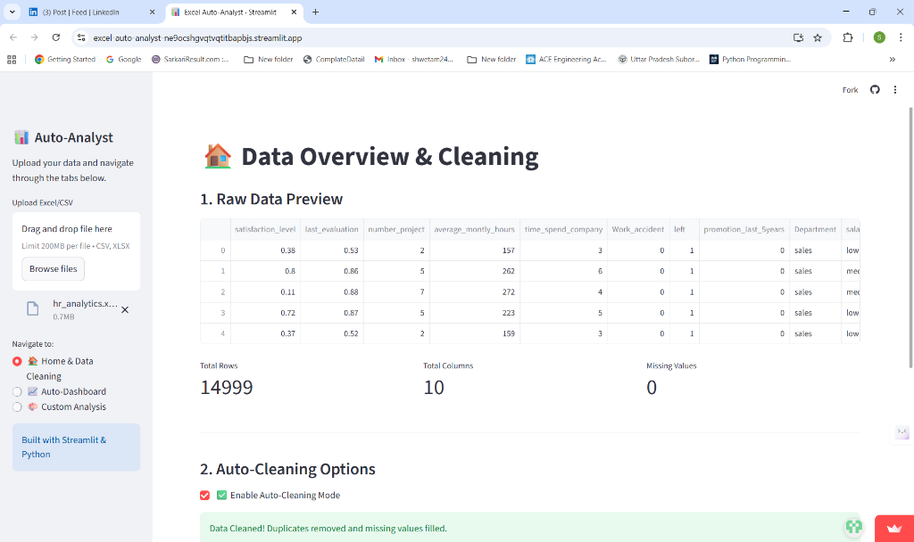
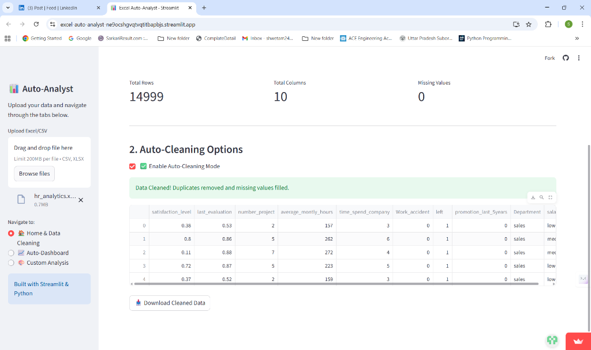
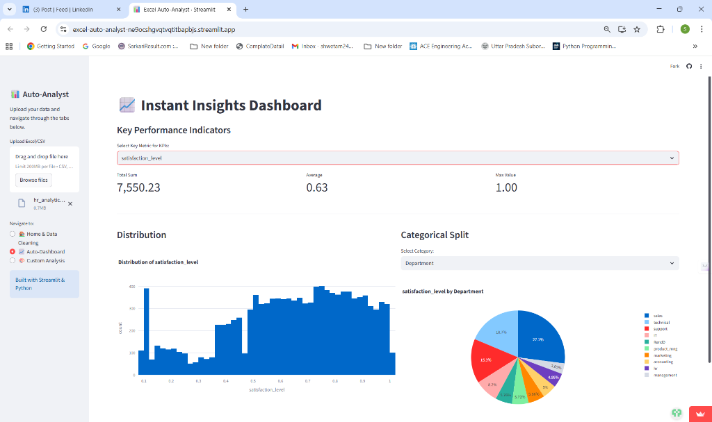
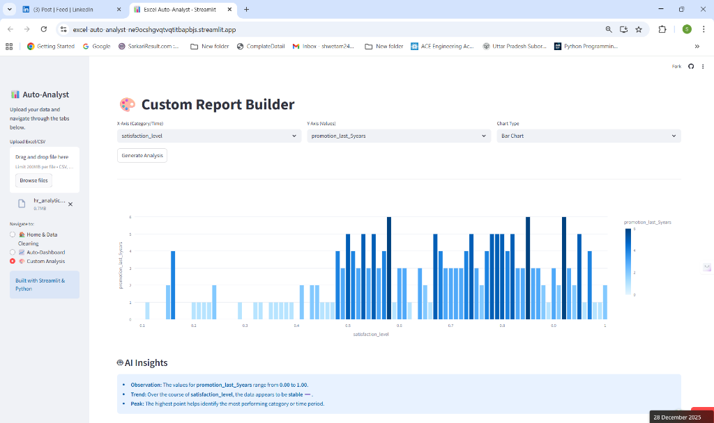

# 📊 Excel Auto-Analyst

**A No-Code Data Analytics Platform built with Python and Streamlit.**

Turn raw Excel/CSV files into interactive dashboards and AI-powered insights instantly—no formulas required.

---

## 📸 Project Demo

### 1. Home & Data Preview
Upload your file and instantly verify data integrity.


### 2. Auto-Cleaning Options
One-click data sanitation (handle missing values, remove duplicates).


### 3. Instant Insights Dashboard
Automatic generation of KPIs, Distributions, and Split metrics.


### 4. Custom Report Builder
Drag-and-drop analysis for specific deep-dives.


---

## 🚀 Features

* **📂 Smart Upload:** Supports `.csv` and `.xlsx` files.
* **🧹 Auto-Cleaning:** One-click removal of duplicates and handling of missing values.
* **📈 Instant Dashboards:** Automatically generates KPI cards, Bar Charts, and Pie Charts based on data types.
* **🎨 Custom Reports:** "Drag-and-drop" style interface to build your own comparison charts.
* **🤖 AI Insights:** Logic-based narrative engine that explains trends and volatility in plain English.

## 🛠️ Tech Stack

* **Python:** Core Logic
* **Streamlit:** UI/Web Framework
* **Pandas:** Data Processing Engine
* **Plotly:** Interactive Visualizations

## 📦 How to Run Locally

1.  **Clone the repository:**
    ```bash
    git clone [https://github.com/your-username/excel-auto-analyst.git](https://github.com/your-username/excel-auto-analyst.git)
    ```
2.  **Install dependencies:**
    ```bash
    pip install -r requirements.txt
    ```
3.  **Run the app:**
    ```bash
    streamlit run app.py
    ```

## ☁️ Deployment

This app is designed to be deployed instantly on **Streamlit Cloud**.
1. Fork this repo.
2. Login to [Streamlit Cloud](https://share.streamlit.io/).
3. Connect your GitHub and select this repository.
4. Click **Deploy**.

---
*Created by Shweta Mishra

